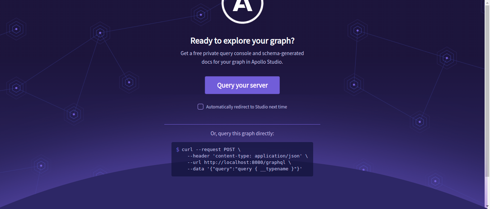
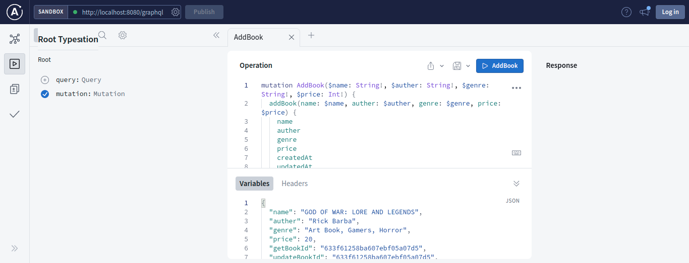

# GraphQL Apollo Server API

#### CRUD API with Apollo Server

Project in Action - [ApolloServerAPI](https://expressapolloserver-api.herokuapp.com/graphql)

#### Run The App Locally

```sh
npm run install
npm run dev
```

- visit url http://localhost:8080/graphql
- Select "Query your server" to open apollo server studio to test the Querys and Mutations
- 





#### To deploy the app on heroku

Whatch this [tutoriel](https://www.youtube.com/watch?v=ncBb2isphzw) to deploy the server properly and fix any error. 
